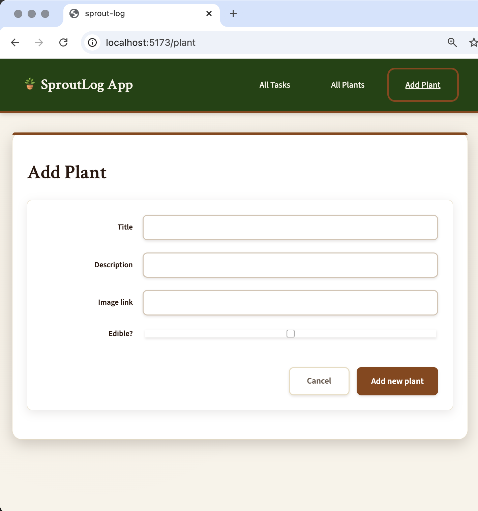
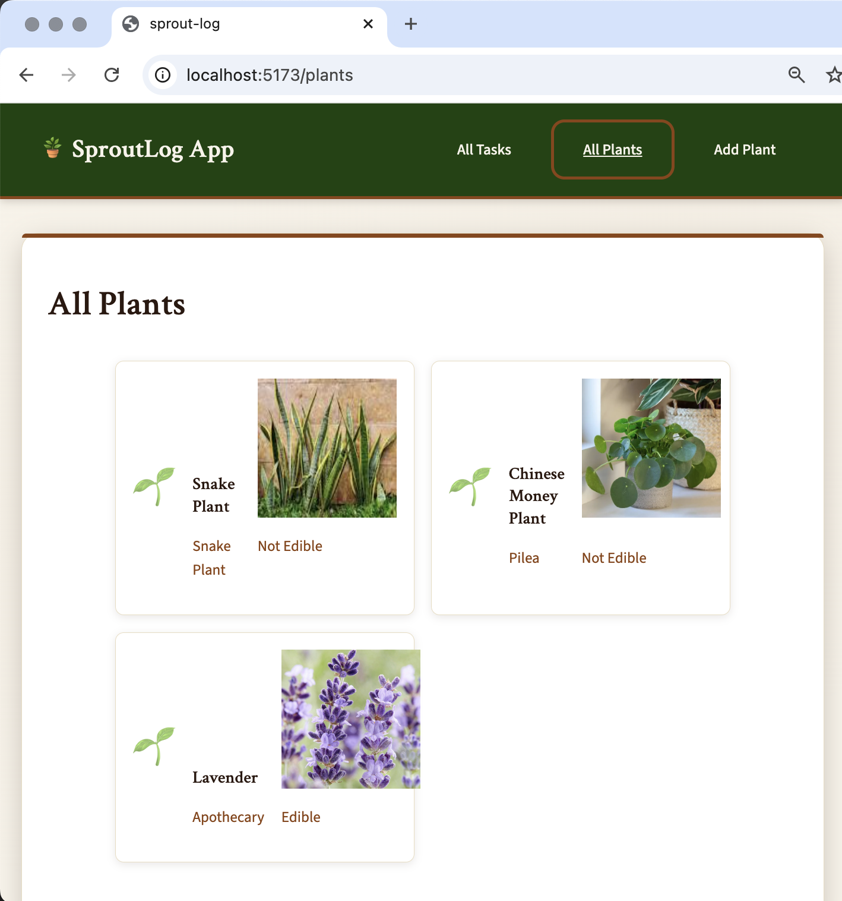
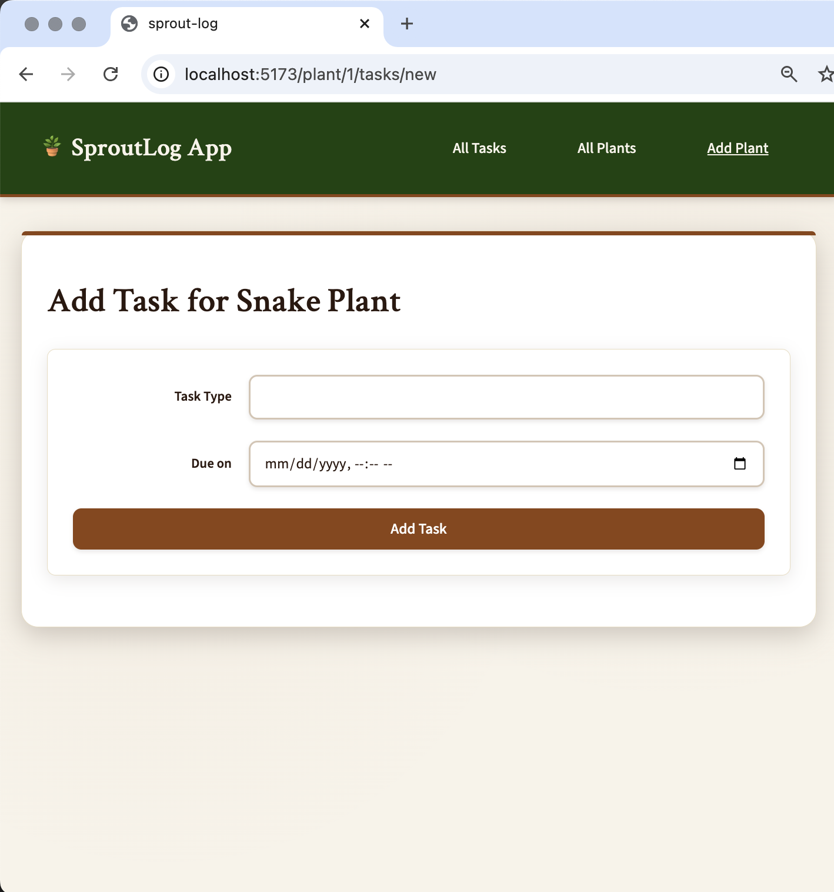
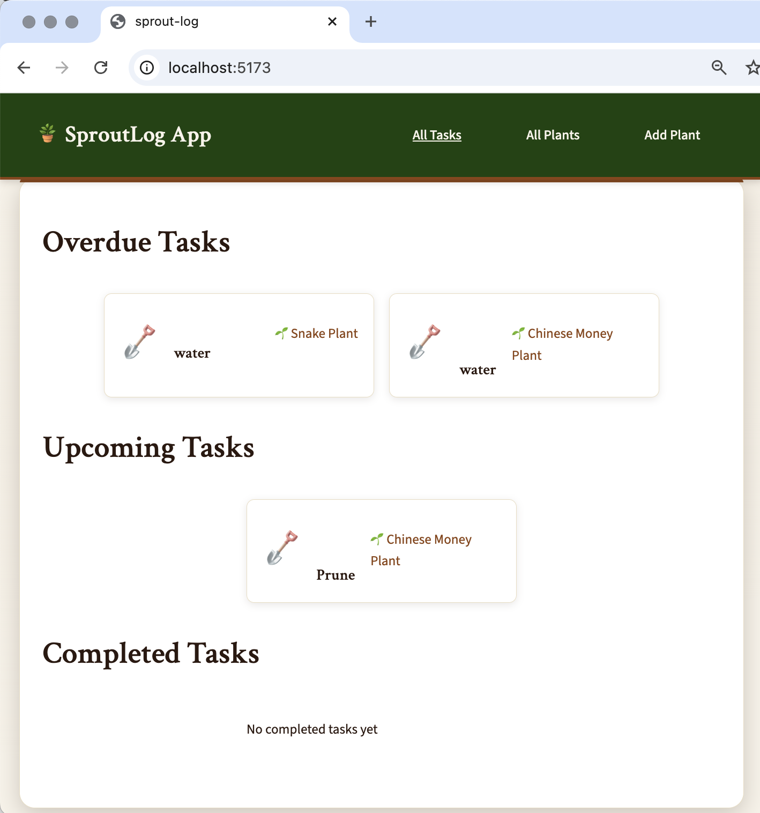
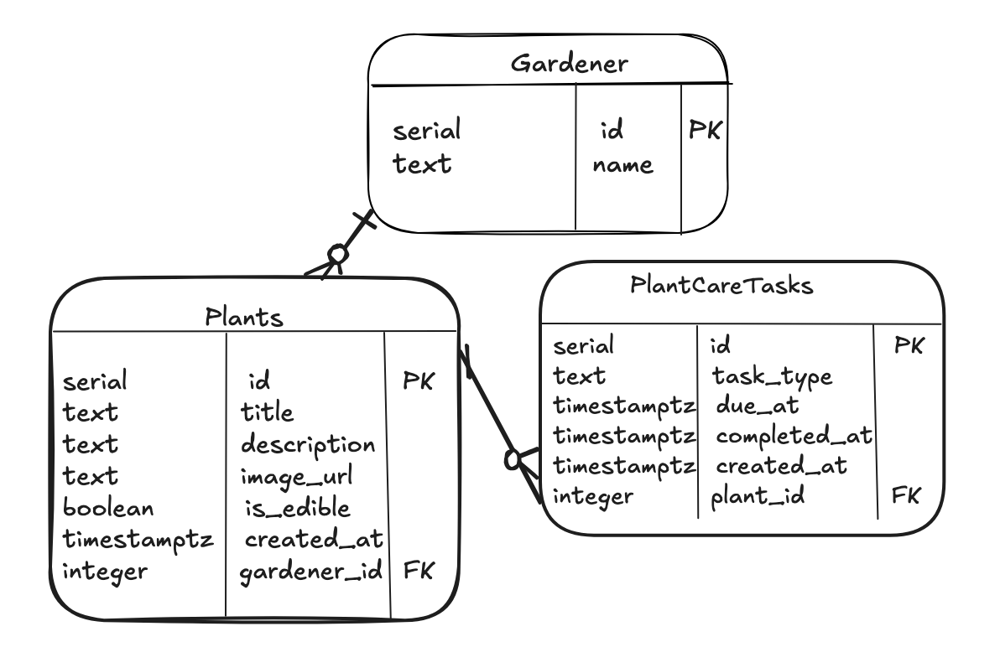
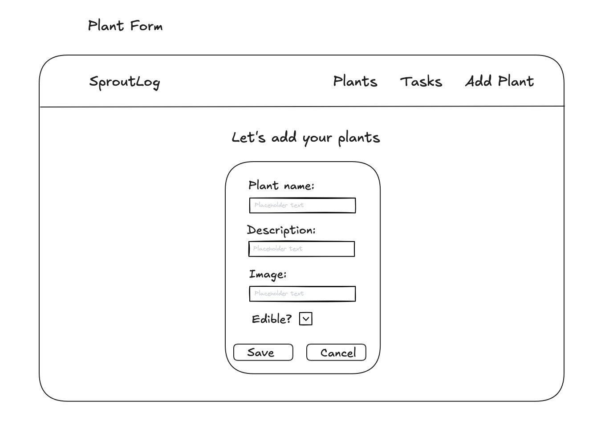
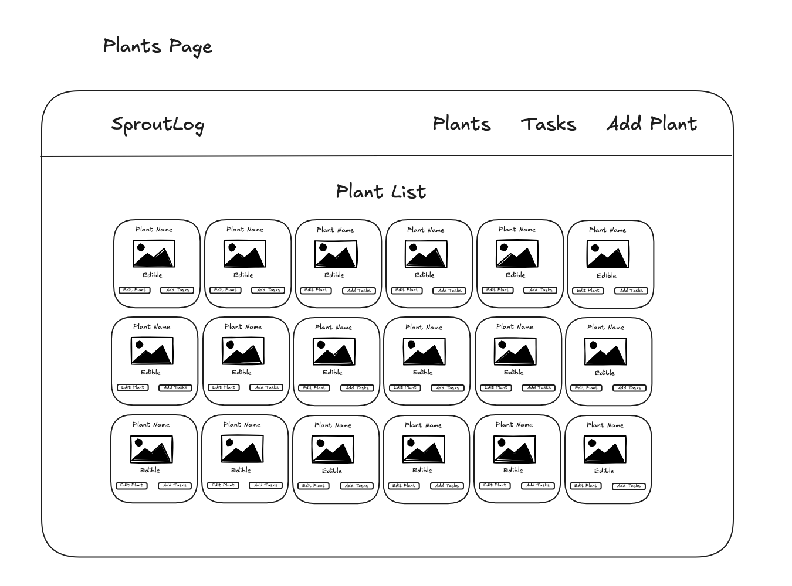
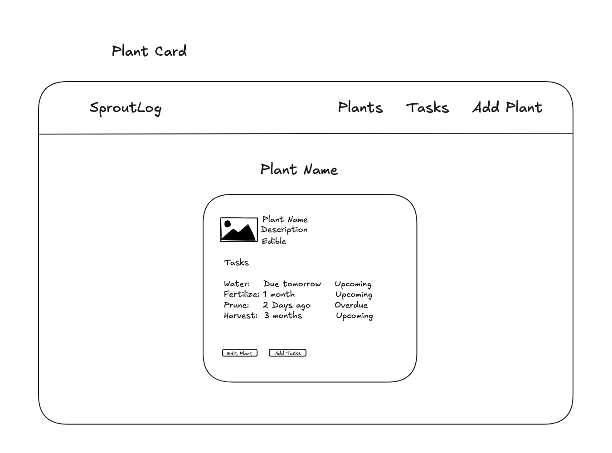
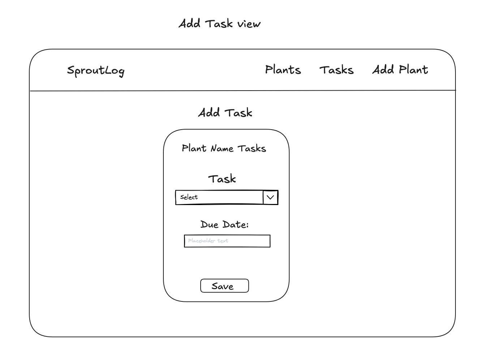
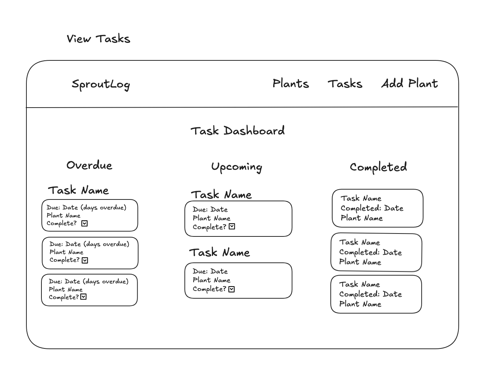

# SproutLog

A full-stack MVP built with React and FastAPI that help plant owners track tasks over time. The app focuses on clean data modeling, time-based logic, and a clear separation of concerns between frontend and backend.

## Visuals

<!-- Depending on what you are making, it can be a good idea to include screenshots or even a video (you'll frequently see GIFs rather than actual videos). Tools like ttygif can help, but check out Asciinema for a more sophisticated method. -->

User can add a plant:

User can view all plants:

User can view plant details:

User can add a task to a plant:

User can view all tasks:


## Tech Stack

### Frontend

- React (Vite)
- JavaScript / CSS

### Backend

- FastAPI
- Python
- PostgreSQL
- Docker

## Local Setup

### Prerequisites:

- Docker
- Node.js
- Python 3.10+

### Frontend Setup

```
cd frontend
npm install
npm run dev
```

Visit:
http://localhost:5173/

### Backend Setup

```
cd backend
python -m venv .venv
source .venv/bin/activate
pip install -r requirements.txt
```

#### Start PostgreSQL (Docker)

```
docker compose up -d
```

#### Enter database:

```
docker compose exec postgres psql -U postgres sproutlog
```

#### Inside psql:

```
\i data/sproutlogs.sql;    -- seed database
\dt                     -- list all tables
exit
```

#### Start FastAPI Server:

```
fastapi dev
```

#### Swagger Docs:

http://localhost:8000/docs

## Roadmap

Future considerations.

Next feature to implement: As a user, I want to mark tasks as completed, so that I can track what care I've already done.

## Contributing

Open to contributions.

## React + TypeScript + Vite

This template provides a minimal setup to get React working in Vite with HMR and some ESLint rules.

## Separation of Concerns

- SQLAlchemy models handle persistence

### User Stories:

1. As a user, I can add then view plants with basic details,so that I can keep track of all the plants I am resonsible for.
2. As a user, I want to create care tasks for a plant with a due date, so that I know what care actions are needed and when.
3. As a user, I want to see which tasks are upcoming or overdue, so that I can prioritize my plant care effectively.

### Tech Stack

- Frontend: React, TypeScript
- Backend: FastAPI, SQLAlchemy, Pydantic
- Database: PostgreSQL

### Entity Relationship Diagram



### Wireframes:

User can add a plant:

User can view all plants:

User can view plant details:

User can add a task to a plant:

User can view all tasks:

